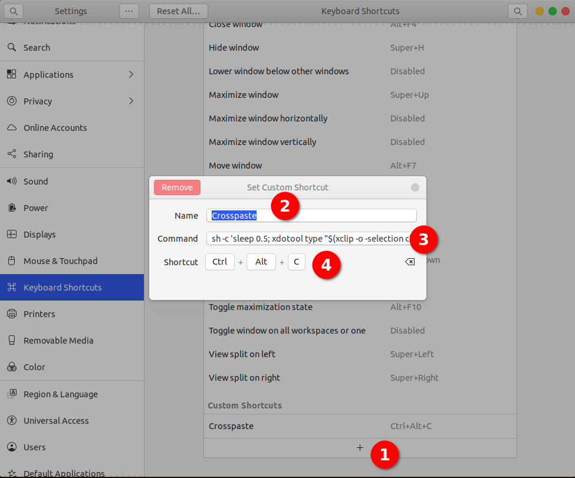
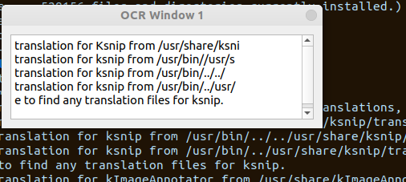

# crosspaste
Linux cross paste (types clipboard content as keystrokes)

### Motivation:

This is useful, when you need to paste some content from clipboard to some application like
vmware's ESXI virtual machine for example or something similar. 

This script will create crosspaste.desktop file in /usr/share/applications 

which you can later invoke by running it as application via launcher or dock.

Basically idea was to clone similar functionality from this windows based solution    
https://christitus.com/clickpaste/


To add it to dock, just right click and choose **Add to Favorites**

### Installation

Copy-paste this command in terminal:

`sudo su -c "bash <(wget -qO- https://raw.githubusercontent.com/acosonic/crosspaste/main/install.sh)" root`


### How to use it?

1. Copy the text you need pasted on clipboard.
2. Click paste icon (you have 2.5 seconds for next step)
3. Switch to application where you need it pasted
4. Wait for text to appear


### How it works:

1. It uses xdtool to acheive keystroke typing taken from clipboard via xclip
2. It waits 2.5 seconds to type keystrokes via sleep command, *you can modify number of seconds by changing that*
3. Script downloads icon and places crosspaste.png to your home folder, you can change it by replacing icon with different one
4. Script creates crosspaste.desktop in /usr/share/applications with following contents

```[Desktop Entry]
Name=Cross Paste
Exec=/bin/bash -c "sh -c 'sleep 2.5; xdotool type \"$(xclip -o -selection clipboard)\"'"
Type=Application
Terminal=false
Icon=/home/youruser/crosspaste.png
```
### Keyboard shortcut

To use this as keyboard shortcut, open ubuntu settings, and navigate to Keyboard Shortcuts
then paste following to command window

`sh -c 'sleep 2.5; xdotool type "$(xclip -o -selection clipboard)"'`



### More ...

If you have reverse problem, can't copy-paste from within for example VmWare ESX to your system,
you can try ksnip tool with ksnip OCR plugin. 
Which can be installed via their continuous build dpkg archives

https://github.com/ksnip/ksnip/releases  
https://github.com/ksnip/ksnip-plugin-ocr/releases/tag/continuous



### Contributors

Thanks to this askubuntu answer
https://askubuntu.com/a/218306/513874


